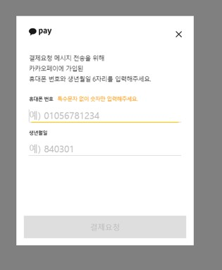
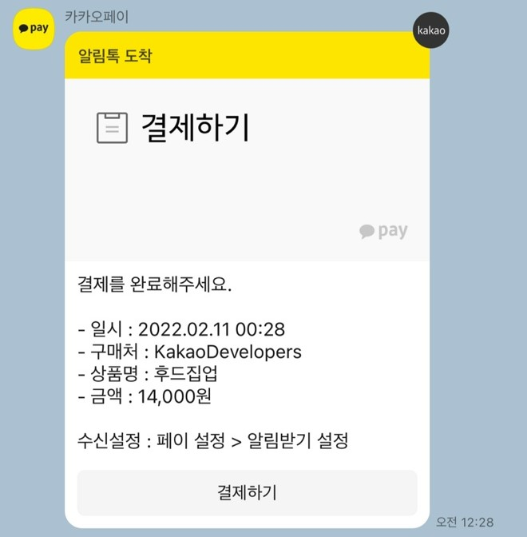

# 카카오페이

### ❗ 확인사항

카카오페이 테스트 모드의 경우 임의의 계정으로 결제가 이루어집니다.

### ✅ 설정 방법

1. #### 아임포트 관리자 콘솔에서 회원가입

   - [https://admin.iamport.kr](https://admin.iamport.kr/) 이메일 계정으로 회원가입 진행

2. #### 테스트 모드 설정

   - #### 일반결제

     [아임포트 관리자 콘솔](https://admin.iamport.kr/)→ 시스템설정 → PG설정(일반결제 및 정기결제) → PG사 *[간편결제]카카오페이* 선택 → 테스트모드 [ON] → 가맹점코드(CID)에 TC0ONETIME 입력 > [전체 저장] 클릭

     

3. #### 결제 연동

   - [카카오페이 일반결제 연동 가이드](https://github.com/iamport/iamport-manual/blob/master/인증결제/sample/kakao.md)

4. #### 실행 후 결과창

   - 결제 정보 등록
   
     
   
   - 결제
   
     