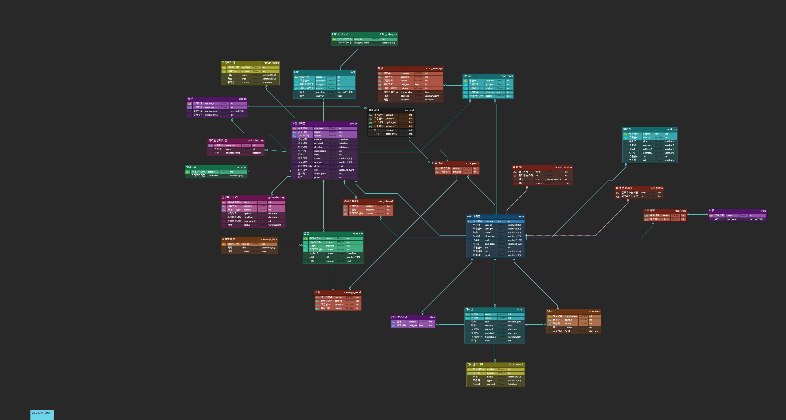

> 혼자가 아닌 함께할 때👐 더욱 좋은 공동구매 서비스 두게더!
>
> 해외직구도 🚀 인플루언서의👸 잇 아이템도 두게더!


개발 기간 : 2022.01.01 ~ 2022.02.17

# 목차

- [기획배경](#기획배경)
- [주요기능](#주요기능)
- [기술스택](#기술스택)
- [프로젝트 세팅 가이드](#프로젝트Setting가이드)
- [만든사람들](#만든사람들)

  

# 기획배경

1. 사소한 음식부터 의류, 가구, 잡화 등 생활속 다양한 물건을 저렴하게 구입하고 싶은 사람들이 많다.

2. 현재 공동구매는 커뮤니티를 통해 이루어지지만 공동구매 인원을 구하는 사이트는 없다.

   

## 타겟 유저

해외직구를 통해 생활용품을 자주 물건을 구입하지만 매번 배송비가 걱정인 구매자

### 페르소나 : 해외 화장품을 자주 구입하는 직장인 A씨

  

# 주요기능

### 1. 공동구매 디자인 

​	: 웹 큐레이팅 서비스에 맞게 사용자가 한눈에 원하는 물건을 구매할 수 있도록 카테고리를 분류하여 직관적으로 디자인함


### 2. 추천 기능

​	 : 사용자가 마이페이지에서 선택한 관심 카테고리, 인기를 기준으로 추천 상품을 보여주어 구매를 유도함


### 3. 공동구매 등록

​	: 구매자뿐만 아니라 판매자의 사용 경험을 고려하여 자신이 주최하고자하는 공동구매의 디테일한 설정뿐 아니라 상품 사진, 옵션, FAQ등을 등록할 수 있		도록 함


### 3. 온라인 커뮤니티

​	: 상품구매, 판매뿐만 아니라 커뮤티니기능을 도입하여 구입한 물건이 마음에 들지 않더라도 재판매가 가능하여 사이트 사용 경험을 향상시킴

# 기술스택

### IDE

- VSCode
- IntelliJ

### Frontend

| Name       | Version |
| ---------- | ------- |
| React      | 17.0.2  |
| TypeScript | 4.5.5   |
| recoil     | 0.5.1   |
|            |         |

### Backend

| Name         | Version |
| ------------ | ------- |
| Java         | 11      |
| Springboot   | 2.6.2   |
| Gradle       | 6.8.3   |
| MySQL        | latest  |
| Lombok       | 1.18.22 |
| JsonWebToken | 0.11.2  |

### DevOps

- Jenkins
- NginX
- Docker

### 협업 툴

- Git Lab
- Notion
- Jira
- Matter Most
- Webex
- Figma


### 와이어 프레임


### ERD




### 서비스 아키텍쳐

### 

# 프로젝트Setting가이드

## Frontend

## Npm 설치

```
Node.js 설치
npm -v 
8. 1. 2
```

### React

```
npm install -g create-react-app

$ cd 해당폴더
$ create-react-app .
```

## Backend

```
Spring Boot dependency setting

	// Spring boot web
	implementation 'org.springframework.boot:spring-boot-starter-web'
	implementation 'org.mybatis.spring.boot:mybatis-spring-boot-starter:2.2.1'
	testImplementation 'org.springframework.boot:spring-boot-starter-test'
	developmentOnly 'org.springframework.boot:spring-boot-devtools'

	// lombok
	compileOnly 'org.projectlombok:lombok:1.18.22'
	annotationProcessor 'org.projectlombok:lombok:1.18.22'	
	testCompileOnly 'org.projectlombok:lombok:1.18.22'
	testAnnotationProcessor 'org.projectlombok:lombok:1.18.22'
	
	// JsonWebToken
	implementation 'io.jsonwebtoken:jjwt-api:0.11.2'
  runtimeOnly 'io.jsonwebtoken:jjwt-impl:0.11.2',
  						"io.jsonwebtoken:jjwt-jackson:0.11.2"
  						
	// JWT Token => DateTypeConverter
	implementation group: 'org.glassfish.jaxb', name: 'jaxb-runtime', version: '2.3.2'	
	
	// DB
	implementation 'mysql:mysql-connector-java'

	//json
	implementation 'org.json:json:20211205'

	//Spring Doc
	asciidoctor 'org.springframework.restdocs:spring-restdocs-asciidoctor'
	testImplementation 'org.springframework.restdocs:spring-restdocs-mockmvc'

	// apache commons IO
	implementation 'commons-io:commons-io:2.6'
```


## 서버

### Yarn 설치

### Open JDK 11 설치

```
$ sudo apt-get install openjdk-11-jdk
$ sudo apt-get isntall openjdk-11-jre
```

### 환경설정

```
$ vim ~/.bashrc
export JAVA_HOME=$(dirname $(dirname $(readlink -f $(which java))))
export PATH=$PATH:$JAVA_HOME/bin
$ source ~/.bashrc
$ echo $JAVA_HOME // /user/lib/jvm/java-11-openjdk-amd64
```

### Gradle 6.8.3 install

```
$ sudo apt install whet unzip // 툴 다운로드
$ cd /tmp
$ wget https://services.gradle.org/distributions/gradle-6.3.8-bin.zip
$ sudo mkdir /opt/gradle
$ sudo unzip -d /opt/gradle gradle-6.8.3-bin.zip
$ export PATH=$PATH:/opt/gradle/gradle-6.8.3/bin
$ gradle -v
```

### Docker 설치

```
# 필수 패키지 설치
sudo apt-get install apt-transport-https ca-certificates curl gnupg-agent software-properties-common
# GPG Key 인증
curl -fsSL https://download.docker.com/linux/ubuntu/gpg | sudo apt-key add -
# docker repository 등록
sudo add-apt-repository "deb [arch=amd64] https://download.docker.com/linux/ubuntu $(lsb_release -cs) stable"
# 도커 설치
sudo apt-get update && sudo apt-get install docker-ce docker-ce-cli containerd.io
# 시스템 부팅시 도커 시작
sudo systemctl enable docker && service docker start
# 도커 확인
sudo service docker status
```

### MySQL 도커 설치 및 컨테이너 실행

```

```

### 프로젝트 실행

```
# frontend(React) 실행
$ git clone https://lab.ssafy.com/s04-final/s04p31a106.git
$ cd frontend
$ yarn install
$ yarn start

# backend(SpringBoot) 실행
$ cd backend
$ gradle build
```

### 젠킨스 설치

```
# 도커 설치 및 실행
$ docker run -d -u root -p {port}:{port} --name={container name} -v /home/admin/docker/jenkins-data:/var/jenkins_home -v /var/run/docker.sock:/var/run/docker.sock -v "$HOME":/home jenkinsci/blueocean

# jenkins 포트 방화벽 오픈
$ sudo iptables -I INPUT 1 -p tcp --dport {port} -j ACCEPT
$ sudo iptables -I OUTPUT 1 -p tcp --dport {port} -j ACCEPT

# 컨테이너 쉘 접속
$ docker exec -it {container name} /bin/bash
```

  

# 만든사람들

### Dogather team

* 윤관
* 장하석
* 홍지범
* 장원종
* 오세헌
* 박진성

